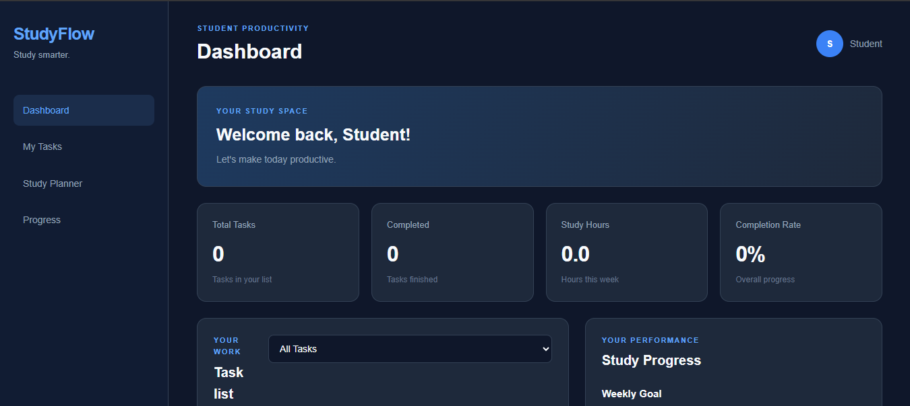

# StudyFlow

A complete, offline-first student productivity web application — no backend, no accounts, no external dependencies.

**Live Demo:** [https://samyaks25.github.io/StudyFlow/](https://samyaks25.github.io/StudyFlow/)  
**Repository:** [github.com/samyaks25/StudyFlow](https://github.com/samyaks25/StudyFlow)



---

## Features

### 📋 Task Management
- Create, edit, and delete tasks with title, subject, priority, hours, and due date
- Mark tasks complete — completion time is recorded for accurate analytics
- Filter by status (all / active / completed), subject, or priority
- Sort by due date, priority, or creation time
- Full-text search across title and subject
- Color-coded priority badges (High / Medium / Low)
- Subject tags with deterministic per-subject color coding

### 📅 Study Planner
- Week-at-a-glance grid: Mon → Sun columns, tasks slotted by due date
- Drag-free scheduling — tasks appear automatically based on their due date
- Visual distinction between overdue, today, and upcoming tasks

### 📊 Progress & Analytics
- **Weekly hours** — bar chart of actual study hours logged this week (Mon–Sun)
- **Subject distribution** — hours allocated per subject across all tasks
- **Monthly completions** — count of tasks completed in the current calendar month
- **Streak counter** — consecutive days with at least one completed task
- **Completion rate** — percentage of all tasks marked done
- **Upcoming deadlines** — next 7 days, sorted by proximity

### ⏱ Focus Timer (Pomodoro)
- 25-minute focus / 5-minute short break / 15-minute long break sessions
- Auto-advance mode: automatically cycles focus → break → focus without clicks
- Tab-sleep resilient: syncs wall-clock time on `visibilitychange` so the timer doesn't drift when the tab is backgrounded
- Web Audio API chime on session completion (no audio files required)
- Logs time to the selected task on session completion
- Circular SVG progress ring with smooth animation

### 💾 Backup & Settings
- **Export** full data as a JSON file (tasks + settings) — downloadable backup
- **Import** a previously exported JSON file — validated before saving
- **Clear all data** with confirmation prompt
- Theme preferences (light / dark — follows system preference by default)
- Notification toggle and sound toggle

### 🌐 Progressive Web App (PWA)
- Installable on desktop and mobile (Add to Home Screen)
- Full offline support via Service Worker (stale-while-revalidate cache)
- App manifest with icons and standalone display mode
- Works without an internet connection after first load

### ♿ Accessibility
- Skip-to-content link for keyboard users
- ARIA roles (`main`, `navigation`, `dialog`, `status`, `region`) on all landmark elements
- All interactive elements have descriptive `aria-label` attributes
- Modal focus trap — Tab key stays inside open modal
- All color contrasts meet WCAG AA

### ⌨ Keyboard Shortcuts
| Key | Action |
|-----|--------|
| `N` | Open new task modal |
| `T` | Jump to Focus Timer view |
| `Escape` | Close open modal |

---

## Architecture

StudyFlow is a **single-page application** (SPA) built with pure HTML, CSS, and JavaScript — zero frameworks, zero build tools, zero external dependencies.

```
Browser
  └── index.html          ← shell: nav sidebar + 6 view containers
       ├── style.css       ← design system: CSS variables, layout, components
       └── script.js       ← IIFE app module (8 internal classes)
            ├── DateUtils          safe date parsing (midday trick)
            ├── StorageManager     localStorage read/write + schema validation
            ├── SoundAlert         Web Audio API chime (no audio files)
            ├── SubjectColors      hash-based deterministic color mapping
            ├── TaskManager        CRUD, filtering, sorting, metrics
            ├── StudyTimer         Pomodoro engine + visibilitychange sync
            └── UIController       routing, rendering, event delegation, modals
```

**Data persistence** — all data lives in `localStorage` under two keys:
- `studyflow_tasks` — JSON array of task objects
- `studyflow_settings` — JSON object of user preferences

No network requests are ever made. No data leaves the browser.

**Routing** — navigation uses `history.pushState` with URL hashes (`#dashboard`, `#tasks`, `#planner`, `#analytics`, `#timer`, `#settings`). Fully compatible with GitHub Pages (hash-based, client-side only).

**Security** — all user-supplied content is inserted via `textContent`, never `innerHTML`. Imported JSON is fully validated and sanitized through `normalizeTask()` before touching storage.

---

## Project Structure

```
StudyFlow/
├── index.html            # App shell — 6 views, 3 modals, sidebar nav
├── style.css             # Design system — variables, layout, all components
├── script.js             # App logic — IIFE module with 8 internal classes
├── sw.js                 # Service Worker — offline cache (stale-while-revalidate)
├── manifest.json         # PWA manifest — icons, display mode, theme color
├── favicon.svg           # Browser tab icon (SVG)
├── icon.svg              # PWA icon (SVG, scalable)
├── icon-192.png          # PWA icon 192×192 (PNG, required by manifest)
├── icon-512.png          # PWA icon 512×512 (PNG, required by manifest)
├── .gitignore            # Ignores node_modules, .DS_Store, graphify-out/, etc.
├── README.md             # This file
├── studyflow-dashboard.png  # Preview screenshot
└── tests/
    ├── test-runner.js    # Node.js unit/integration tests (10 tests)
    └── ui-simulation.js  # localStorage persistence simulation tests
```

---

## Getting Started

### Option 1 — Open directly (quickest)
```
Double-click index.html
```
That's it. No server, no build step, no install required.

### Option 2 — Local dev server (recommended for PWA features)
Service Workers require a secure context (`localhost` or `https://`). To test PWA install and offline mode locally:

```bash
# Python 3 (built-in)
python -m http.server 8080

# Node.js (npx, no install)
npx serve .

# VS Code
# Install the "Live Server" extension, right-click index.html → Open with Live Server
```

Then open [http://localhost:8080](http://localhost:8080).

### Running Tests
```bash
node tests/test-runner.js    # 10 unit/integration tests
node tests/ui-simulation.js  # localStorage simulation tests
```
Both suites exit with code 0 on success.

---

## Deployment — GitHub Pages

1. Push to GitHub:
   ```bash
   git add .
   git commit -m "feat: StudyFlow v2.0"
   git push origin main
   ```

2. In your GitHub repo: **Settings → Pages → Source → Deploy from branch → `main` / `(root)` → Save**

3. Your app will be live at `https://<your-username>.github.io/<repo-name>/` within ~60 seconds.

> [!NOTE]
> No extra configuration is needed. All paths in the app are relative, so GitHub Pages serves it correctly from any sub-path.

---

## Browser Compatibility

| Browser | Support |
|---------|---------|
| Chrome 89+ | ✅ Full (PWA + Web Audio) |
| Firefox 85+ | ✅ Full |
| Safari 15.4+ | ✅ Full (PWA on iOS 16.4+) |
| Edge 89+ | ✅ Full |
| Opera 75+ | ✅ Full |

> [!NOTE]
> Web Audio API chimes require a user gesture before first play (browser policy). The timer chime triggers only after the user has started the timer via a button click — no autoplay issues.

---

## Task Object Schema

Understanding the data format is useful for manual backup editing or building on top of StudyFlow:

```json
{
  "id": "uuid-v4-string",
  "title": "Read Chapter 5",
  "subject": "Biology",
  "priority": "high",
  "hours": 2,
  "dueDate": "2025-10-15",
  "status": "active",
  "createdAt": 1728000000000,
  "completedAt": null,
  "loggedMinutes": 0,
  "notes": ""
}
```

| Field | Type | Values |
|-------|------|--------|
| `id` | string | UUID v4 (or timestamp fallback) |
| `title` | string | Non-empty, required |
| `subject` | string | Free text |
| `priority` | string | `"high"` \| `"medium"` \| `"low"` |
| `hours` | number | 0–24 |
| `dueDate` | string | `"YYYY-MM-DD"` or `""` |
| `status` | string | `"active"` \| `"completed"` |
| `createdAt` | number | Unix ms timestamp |
| `completedAt` | number \| null | Unix ms timestamp when completed |
| `loggedMinutes` | number | Accumulated focus timer minutes |
| `notes` | string | Free text |

---

## Troubleshooting

**Timer drifts when tab is in background**  
The timer uses wall-clock (`Date.now()`) synchronization on `visibilitychange`. If you observe drift, ensure your browser is not suspending JavaScript in background tabs (check battery/performance settings).

**PWA install prompt doesn't appear**  
The app must be served over `https://` or `localhost`. File-open (`file://`) does not meet the secure context requirement for PWA installation.

**Data not saved between sessions**  
StudyFlow uses `localStorage`. Ensure you're not in a private/incognito browser window, which typically clears storage on tab close. Also check that the browser hasn't been set to clear site data on exit.

**Import fails silently**  
Only JSON files exported by StudyFlow are supported. The importer validates every task through the normalizer and skips malformed entries — a malformed file produces no tasks rather than an error.

**Dark mode not applying**  
The app follows your OS color scheme preference (`prefers-color-scheme: dark`). To force dark mode, change your OS appearance settings. A manual toggle is available in Settings → Appearance.

---

## Privacy

StudyFlow stores all data locally in your browser's `localStorage`. No data is ever sent to any server. There is no analytics, no telemetry, no tracking, and no accounts. Clearing browser data or using private mode erases all StudyFlow data.

---

## License

MIT — free to use, modify, and redistribute. See [LICENSE](LICENSE) if present, or assume standard MIT terms.